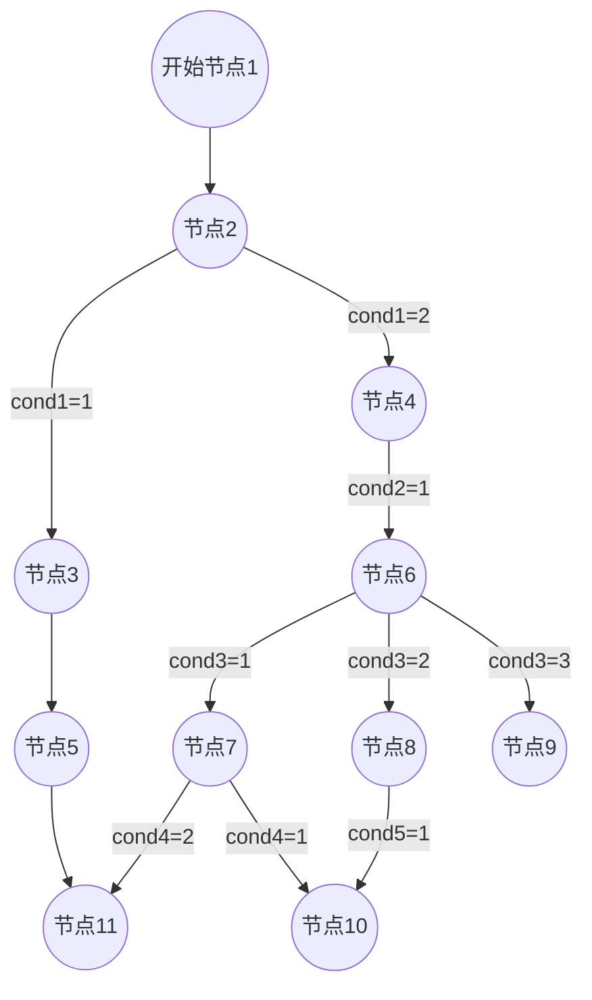

# 概述

朴素条件模式的规则引擎

(个人看法，易用的规则引擎，相比低代码更符合需要)

## 支持形式
简单规则引擎，支持任务流形式规则处理

## 适用
1、Flow形式流程定义和执行
* 支持条件分支和条件合并
* 不支持DAG
* 暂不支持嵌套运算符（可扩展实现，实现Antlr的Listener对象即可）

2、需搭配mysql运行

## 数据结构
包括以下三层，以及其对应关系

1、flow
    业务单位，包含1-N个task

2、task
    执行单元，包含1-N个rule

3、rule
    规则，key-value 形式

# 模块说明
## DSL
基于 Antlr4，对应两个文法定义文件在 flow/dsl/conf 下：
* Rule：用于正向执行，包括：
    * 【本节点要执行的操作】，对应内容来自 t_task_rule.content 字段
    * 【下一个可能满足开启条件的节点】，对应内容来自 t_flow_task.next 字段
    * 【结果需汇入参数池】
* Topology：用于反向判断
    * 【某节点是否满足开启条件】，对应内容来自 t_flow_task.pre 字段
    * 【结果不回写参数池】

## model
DB操作相关，包括 resources/mapper/ 

## entity
whatever这个名字，是 runtime 直接使用的对象

## runtime
主要执行逻辑，包括 DSL 的非生成部分
两种模式在 FlowSession 初始化时设定

### runtime/visitor
DSL 的 visitor 实现
* 不支持嵌套计算式
### runtime/listener
DSL 的 listener 实现
* 支持嵌套计算式(可参看test下的示例)
* TODO：preCondition的处理（对应 TopologyVisitorExecutor)

# 其他
## 测试数据
test_data.sql：测试用flow配置

## 规则表达式支持嵌套的实现

通过 Listener 方式实现 (TaskRuleListenerExecutor)

# FAQ
## 变量名称
仅支持字符（大小写都可）

## 规则(计算式)格式

* 逗号：以逗号结尾，只是 DSL 文法上更明确，并不影响实际生成解析 tree (会有个扎眼的红色警告)

## DSL两种模式：visitor 和 listener

* Visitor中，可以自行控制遍历的方法/顺序
    * 传递信息
        * 输入：通过 context 的方式传递，有自动生成的代码管理，可修改但不好把控
        * 输出：可用return的方法向外返回
    * 必须指定(返回值)类型，这个会带来一些处理不便
* Listener中，无法控制遍历顺序
    * 传递信息需要自己处理，一般类中会自定义数据体(如，TaskRuleListenerExecutor.memory )
    * 外部获取值，要么通过约定key/变量来处理，要么通过类似 xxx.getValue(tree) 读取根节点的对应输出